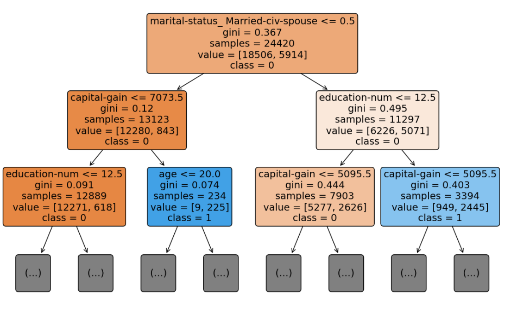

# 1. 결정트리(Desicion Tree)

+ 앙상블을 구성하는 개별 모델을 XGBoost에서는 **기본학습기(base learner)** 라고 함
    + XGBoost의 기본 학습기로 가장 널리 사용되는 것이 결정트리

+ **결정트리**는 과적합되기 쉬우므로, 분산과 편향을 다루며 이 문제를 살펴 볼 것

+ 과적합을 막는 방법은

    1. 하이퍼 파라미터 튜닝

    2. 여러 트리의 예측을 모으는 것 (RF와 XGBoost)


## 1.1. 결정트리 알고리즘

결정트리는 **가지(branch)** 분할을 통해 데이터를 두 개의 **노드(node)** 로 나눕니다. 가지 분할은 예측을 만드는 **리프 노드(leaf node)** 까지 계속됩니다.


### 1.1.1. 용어 설명


위의 내용 해석

**루트노드**

- 첫 노드인 루트노드는 현재 결혼 유무에 따라서 분할을 하였음
- 왼쪽이 결혼을 안한 True로 0값, 오른쪽이 결혼을 한 True로 1임

**지니불순도**

- $gini = 1 - \sum_{i=1}^c(p_i)^2$ , $p_i$는 전체 샘플에서 해당 클래스 샘플의 비율, c는 총 클래스 개수
- 불순도 값이 가장 낮은 분할을 찾는 것이 트리의 목표
- 루트노드의 gini=0.367
- gini값이 0이면 하나의 클래스로만 이루어진 노드가 됨
- gini값이 0.5이면 클래스 간 샘플 개수가 동일함

**samples**

- sample 수

**value**

- 현재 노드에서 y값이 0인 개수와 y값이 1인 개수를 각각 나타냄

**class**

- 현재 노드의 다수 클래스가 무엇인지 나타냄

**리프노드**

- 트리의 끝에 있는 노드
- 리프노드에서 최종 예측이 결정되고, 다수인 클래스가 예측 클래스가 됨

**분할방식**

- 왼쪽이 True, 오른쪽이 False 노드로 분류됨


## 1.2. 결정트리 코드

### 1.2.1. Classifier

```python
import pandas as pd
import numpy as np

# 1. 데이터 준비
df_census = pd.read_csv('census_cleaned.csv')

# 데이터를 X와 y로 나눕니다.
X = df_census.iloc[:,:-1]
y = df_census.iloc[:,-1]

# 데이터를 훈련 세트와 테스트 세트로 나눕니다.
from sklearn.model_selection import train_test_split
X_train, X_test, y_train, y_test = train_test_split(X, y, random_state=42)

# 2. 모델적합
from sklearn.tree import DecisionTreeClassifier
from sklearn.metrics import accuracy_score

# 분류 모델을 만듭니다.
clf = DecisionTreeClassifier(random_state=2)
clf.fit(X_train, y_train)

# 테스트 데이터에 대한 예측을 만듭니다.
y_pred = clf.predict(X_test)

# 정확도를 계산합니다.
accuracy_score(y_pred, y_test)

df_census.head()
```

<table border="1" class="dataframe">
  <thead>
    <tr style="text-align: right;">
      <th></th>
      <th>age</th>
      <th>fnlwgt</th>
      <th>education-num</th>
      <th>capital-gain</th>
      <th>capital-loss</th>
      <th>hours-per-week</th>
      <th>workclass_ ?</th>
      <th>workclass_ Federal-gov</th>
      <th>workclass_ Local-gov</th>
      <th>workclass_ Never-worked</th>
      <th>...</th>
      <th>native-country_ Puerto-Rico</th>
      <th>native-country_ Scotland</th>
      <th>native-country_ South</th>
      <th>native-country_ Taiwan</th>
      <th>native-country_ Thailand</th>
      <th>native-country_ Trinadad&amp;Tobago</th>
      <th>native-country_ United-States</th>
      <th>native-country_ Vietnam</th>
      <th>native-country_ Yugoslavia</th>
      <th>income_ &gt;50K</th>
    </tr>
  </thead>
  <tbody>
    <tr>
      <th>0</th>
      <td>39</td>
      <td>77516</td>
      <td>13</td>
      <td>2174</td>
      <td>0</td>
      <td>40</td>
      <td>0</td>
      <td>0</td>
      <td>0</td>
      <td>0</td>
      <td>...</td>
      <td>0</td>
      <td>0</td>
      <td>0</td>
      <td>0</td>
      <td>0</td>
      <td>0</td>
      <td>1</td>
      <td>0</td>
      <td>0</td>
      <td>0</td>
    </tr>
    <tr>
      <th>1</th>
      <td>50</td>
      <td>83311</td>
      <td>13</td>
      <td>0</td>
      <td>0</td>
      <td>13</td>
      <td>0</td>
      <td>0</td>
      <td>0</td>
      <td>0</td>
      <td>...</td>
      <td>0</td>
      <td>0</td>
      <td>0</td>
      <td>0</td>
      <td>0</td>
      <td>0</td>
      <td>1</td>
      <td>0</td>
      <td>0</td>
      <td>0</td>
    </tr>
    <tr>
      <th>2</th>
      <td>38</td>
      <td>215646</td>
      <td>9</td>
      <td>0</td>
      <td>0</td>
      <td>40</td>
      <td>0</td>
      <td>0</td>
      <td>0</td>
      <td>0</td>
      <td>...</td>
      <td>0</td>
      <td>0</td>
      <td>0</td>
      <td>0</td>
      <td>0</td>
      <td>0</td>
      <td>1</td>
      <td>0</td>
      <td>0</td>
      <td>0</td>
    </tr>
    <tr>
      <th>3</th>
      <td>53</td>
      <td>234721</td>
      <td>7</td>
      <td>0</td>
      <td>0</td>
      <td>40</td>
      <td>0</td>
      <td>0</td>
      <td>0</td>
      <td>0</td>
      <td>...</td>
      <td>0</td>
      <td>0</td>
      <td>0</td>
      <td>0</td>
      <td>0</td>
      <td>0</td>
      <td>1</td>
      <td>0</td>
      <td>0</td>
      <td>0</td>
    </tr>
    <tr>
      <th>4</th>
      <td>28</td>
      <td>338409</td>
      <td>13</td>
      <td>0</td>
      <td>0</td>
      <td>40</td>
      <td>0</td>
      <td>0</td>
      <td>0</td>
      <td>0</td>
      <td>...</td>
      <td>0</td>
      <td>0</td>
      <td>0</td>
      <td>0</td>
      <td>0</td>
      <td>0</td>
      <td>0</td>
      <td>0</td>
      <td>0</td>
      <td>0</td>
    </tr>
  </tbody>
</table>
<p>5 rows × 93 columns</p>


### 1.2.2. 트리플랏

```python
# 트리플랏 코드
import matplotlib.pyplot as plt
from sklearn.tree import plot_tree

plt.figure(figsize=(13,8))
plot_tree(clf, max_depth=2, feature_names=list(X.columns), class_names=['0','1'], filled=True, rounded=True, fontsize=14)
plt.show()
```



