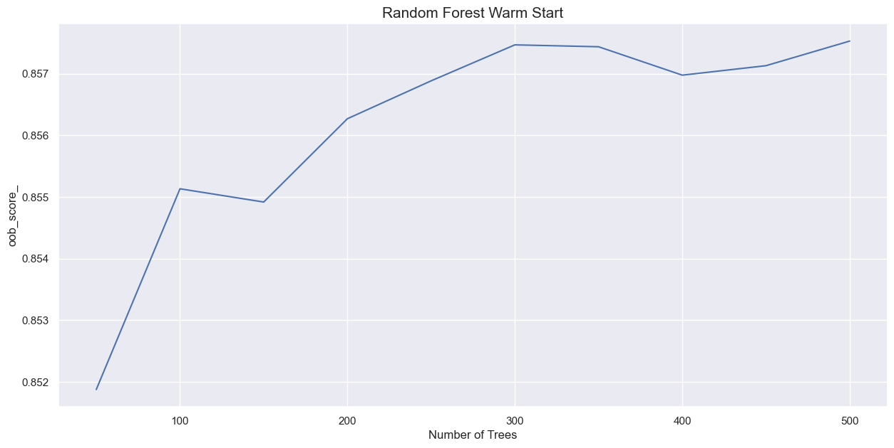
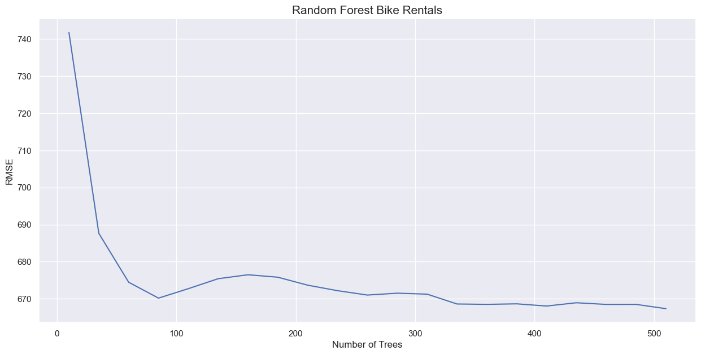

[2. 랜덤포레스트](#2-랜덤포레스트)

- [2.1. 배깅과 랜덤포레스트](#21-배깅과-랜덤포레스트)
	- [2.1.1. 배깅](#211-배깅)
	- [2.1.2. 랜덤 포레스트](#212-랜덤-포레스트)
- [2.2. 랜덤포레스트 모델](#22-랜덤포레스트-모델)
	- [2.2.1. Classifier](#221-classifier)
	- [2.2.2. Regressor](#222-regressor)
- [2.3. 랜덤포레스트 하이퍼파라미터](#23-랜덤포레스트-하이퍼파라미터)
	- [2.3.1. oob_score](#231-oob_score)
	- [2.3.2. n_estimators](#232-n_estimators)
		- [n_estimators = 50](#n_estimators--50)
		- [n_estimators = 150](#n_estimators--150)
	- [2.3.3. warm_start](#233-warm_start)
	- [2.3.4. bootstrap](#234-bootstrap)
	- [2.3.5. verbose](#235-verbose)
	- [2.3.6. class_weight](#236-class_weight)
	- [2.3.7. max_samples](#237-max_samples)
	- [2.3.8. 결정트리 매개변수](#238-결정트리-매개변수)
		- [트리 깊이](#트리-깊이)
		- [분할](#분할)
		- [리프 노드](#리프-노드)
- [2.4. 하이퍼파라미터 튜닝](#24-하이퍼파라미터-튜닝)
	- [2.4.1. n_estimators 적정값 찾기](#241-n_estimators-적정값-찾기)
	- [2.4.2. RandomizedSearchCV - Regression](#242-randomizedsearchcv---regression)
- [2.5. ExtraTreesClassifier](#25-extratreesclassifier)


# 2. 랜덤포레스트

## 2.1. 배깅과 랜덤포레스트

### 2.1.1. 배깅

> 부트스트랩 애그리게이션의 약자

**진행방법**

1. 전체 데이터에서 부트스트랩 샘플 N개를 L회 추출
2. L개의 데이터 셋을 이용해서, L개의 모델을 구축
3. L개의 모델을 앙상블(애그리게이팅) 하여, 앙상블 분류기 생성

4. **분류기의 앙상블**은 **다수결 투표**로 진행함
    + sklearn 함수 `VotingClassifier` 로 구현 가능
    + 

### 2.1.2. 랜덤 포레스트

> 결정트리를 이용해서 배깅 방식으로 앙상블 구현한 것

+ 랜덤 포레스트의 경우 모델의 분산이 줄어들게 됨
+ 기본적으로 랜덤 포레스트 분류기는 노드를 분할할 때, 특성 개수의 제곱근을 사용함
    + 100개의 특성이 있다면, 10개의 특성만 이용함
    + 따라서, 중복 샘플을 가진 두 트리의 예측이 달라지므로 앙상블이 의미가 있음
+ 노드를 분할할 때, 특성의 최선의 분할 기준을 찾아 분할


## 2.2. 랜덤포레스트 모델

### 2.2.1. Classifier

```python
# 1. data 로드
import pandas as pd
import warnings
warnings.filterwarnings('ignore')

df_census = pd.read_csv('census_cleaned.csv')

## 데이터를 X와 y로 나누기
X_census = df_census.iloc[:,:-1]
y_census = df_census.iloc[:,-1]

df_census.head()
```

<table border="1" class="dataframe">
  <thead>
    <tr style="text-align: right;">
      <th></th>
      <th>age</th>
      <th>fnlwgt</th>
      <th>education-num</th>
      <th>capital-gain</th>
      <th>capital-loss</th>
      <th>hours-per-week</th>
      <th>workclass_ ?</th>
      <th>workclass_ Federal-gov</th>
      <th>workclass_ Local-gov</th>
      <th>workclass_ Never-worked</th>
      <th>...</th>
      <th>native-country_ Puerto-Rico</th>
      <th>native-country_ Scotland</th>
      <th>native-country_ South</th>
      <th>native-country_ Taiwan</th>
      <th>native-country_ Thailand</th>
      <th>native-country_ Trinadad&amp;Tobago</th>
      <th>native-country_ United-States</th>
      <th>native-country_ Vietnam</th>
      <th>native-country_ Yugoslavia</th>
      <th>income_ &gt;50K</th>
    </tr>
  </thead>
  <tbody>
    <tr>
      <th>0</th>
      <td>39</td>
      <td>77516</td>
      <td>13</td>
      <td>2174</td>
      <td>0</td>
      <td>40</td>
      <td>0</td>
      <td>0</td>
      <td>0</td>
      <td>0</td>
      <td>...</td>
      <td>0</td>
      <td>0</td>
      <td>0</td>
      <td>0</td>
      <td>0</td>
      <td>0</td>
      <td>1</td>
      <td>0</td>
      <td>0</td>
      <td>0</td>
    </tr>
    <tr>
      <th>1</th>
      <td>50</td>
      <td>83311</td>
      <td>13</td>
      <td>0</td>
      <td>0</td>
      <td>13</td>
      <td>0</td>
      <td>0</td>
      <td>0</td>
      <td>0</td>
      <td>...</td>
      <td>0</td>
      <td>0</td>
      <td>0</td>
      <td>0</td>
      <td>0</td>
      <td>0</td>
      <td>1</td>
      <td>0</td>
      <td>0</td>
      <td>0</td>
    </tr>
    <tr>
      <th>2</th>
      <td>38</td>
      <td>215646</td>
      <td>9</td>
      <td>0</td>
      <td>0</td>
      <td>40</td>
      <td>0</td>
      <td>0</td>
      <td>0</td>
      <td>0</td>
      <td>...</td>
      <td>0</td>
      <td>0</td>
      <td>0</td>
      <td>0</td>
      <td>0</td>
      <td>0</td>
      <td>1</td>
      <td>0</td>
      <td>0</td>
      <td>0</td>
    </tr>
    <tr>
      <th>3</th>
      <td>53</td>
      <td>234721</td>
      <td>7</td>
      <td>0</td>
      <td>0</td>
      <td>40</td>
      <td>0</td>
      <td>0</td>
      <td>0</td>
      <td>0</td>
      <td>...</td>
      <td>0</td>
      <td>0</td>
      <td>0</td>
      <td>0</td>
      <td>0</td>
      <td>0</td>
      <td>1</td>
      <td>0</td>
      <td>0</td>
      <td>0</td>
    </tr>
    <tr>
      <th>4</th>
      <td>28</td>
      <td>338409</td>
      <td>13</td>
      <td>0</td>
      <td>0</td>
      <td>40</td>
      <td>0</td>
      <td>0</td>
      <td>0</td>
      <td>0</td>
      <td>...</td>
      <td>0</td>
      <td>0</td>
      <td>0</td>
      <td>0</td>
      <td>0</td>
      <td>0</td>
      <td>0</td>
      <td>0</td>
      <td>0</td>
      <td>0</td>
    </tr>
  </tbody>
</table>
<p>5 rows × 93 columns</p>

```python
# 2. 랜덤 포레스트 모델을 생성
import numpy as np
from sklearn.ensemble import RandomForestClassifier
from sklearn.model_selection import cross_val_score

rf = RandomForestClassifier(n_estimators=10, random_state=42, n_jobs=-1)

## 교차 검증 수행
scores = cross_val_score(rf, X_census, y_census, cv=5)

## 정확도를 출력
print('정확도:', np.round(scores, 3))
print('정확도 평균: %0.3f' % (scores.mean()))
```


### 2.2.2. Regressor

```python
# 1. data 로드
import pandas as pd
import warnings
warnings.filterwarnings('ignore')

df_bikes = pd.read_csv('bike_rentals_cleaned.csv')

## 데이터를 X와 y로 나눕니다.
X_bikes = df_bikes.iloc[:,:-1]
y_bikes = df_bikes.iloc[:,-1]

df_bikes.head()
```

<table border="1" class="dataframe">
  <thead>
    <tr style="text-align: right;">
      <th></th>
      <th>instant</th>
      <th>season</th>
      <th>yr</th>
      <th>mnth</th>
      <th>holiday</th>
      <th>weekday</th>
      <th>workingday</th>
      <th>weathersit</th>
      <th>temp</th>
      <th>atemp</th>
      <th>hum</th>
      <th>windspeed</th>
      <th>cnt</th>
    </tr>
  </thead>
  <tbody>
    <tr>
      <th>0</th>
      <td>1</td>
      <td>1.0</td>
      <td>0.0</td>
      <td>1.0</td>
      <td>0.0</td>
      <td>6.0</td>
      <td>0.0</td>
      <td>2</td>
      <td>0.344167</td>
      <td>0.363625</td>
      <td>0.805833</td>
      <td>0.160446</td>
      <td>985</td>
    </tr>
    <tr>
      <th>1</th>
      <td>2</td>
      <td>1.0</td>
      <td>0.0</td>
      <td>1.0</td>
      <td>0.0</td>
      <td>0.0</td>
      <td>0.0</td>
      <td>2</td>
      <td>0.363478</td>
      <td>0.353739</td>
      <td>0.696087</td>
      <td>0.248539</td>
      <td>801</td>
    </tr>
    <tr>
      <th>2</th>
      <td>3</td>
      <td>1.0</td>
      <td>0.0</td>
      <td>1.0</td>
      <td>0.0</td>
      <td>1.0</td>
      <td>1.0</td>
      <td>1</td>
      <td>0.196364</td>
      <td>0.189405</td>
      <td>0.437273</td>
      <td>0.248309</td>
      <td>1349</td>
    </tr>
    <tr>
      <th>3</th>
      <td>4</td>
      <td>1.0</td>
      <td>0.0</td>
      <td>1.0</td>
      <td>0.0</td>
      <td>2.0</td>
      <td>1.0</td>
      <td>1</td>
      <td>0.200000</td>
      <td>0.212122</td>
      <td>0.590435</td>
      <td>0.160296</td>
      <td>1562</td>
    </tr>
    <tr>
      <th>4</th>
      <td>5</td>
      <td>1.0</td>
      <td>0.0</td>
      <td>1.0</td>
      <td>0.0</td>
      <td>3.0</td>
      <td>1.0</td>
      <td>1</td>
      <td>0.226957</td>
      <td>0.229270</td>
      <td>0.436957</td>
      <td>0.186900</td>
      <td>1600</td>
    </tr>
  </tbody>
</table>

```python
# 2. 모델생성
import numpy as np
from sklearn.ensemble import RandomForestRegressor
from sklearn.model_selection import cross_val_score

# RandomForestRegressor 객체 생성
rf = RandomForestRegressor(n_estimators=10, random_state=42, n_jobs=-1)

# 평균 제곱 오차를 사용해 교차 검증을 수행
scores = cross_val_score(rf, X_bikes, y_bikes, scoring='neg_mean_squared_error', cv=10)

# 오차의 제곱근을 계산
rmse = np.sqrt(-scores)

# rmse를 출력
print('RMSE:', np.round(rmse, 3))
print('RMSE 평균: %0.3f' % (rmse.mean()))
```

```
RMSE: [ 822.698  538.627  528.881  798.944  898.384  959.242  836.593  762.641
  905.953 2252.834]
RMSE 평균: 930.480
```


## 2.3. 랜덤포레스트 하이퍼파라미터

### 2.3.1. oob_score

> 랜덤 포레스트를 생성하면서, 사용하지 않은 샘플을 이용하여 모델을 평가하는 옵션

+ 랜덤 포레스트를 생성 완료한 후, 샘플 $(x_i, y_i)$가 포함되지 않은 트리들에서 $(x_i, y_i)$를 적합하여 그 결과를 평균 scroing 한 것
+ `Bootstrap = True(default)` 인 경우에만 사용할 수 있음
+ [공식문서설명](https://scikit-learn.org/stable/auto_examples/ensemble/plot_ensemble_oob.html#sphx-glr-auto-examples-ensemble-plot-ensemble-oob-py)


```python
# oob_score=True로 랜덤 포레스트 모델을 생성
from sklearn.ensemble import RandomForestClassifier
rf = RandomForestClassifier(oob_score=True, n_estimators=10, random_state=42, n_jobs=-1)

# 인구 조사 데이터셋으로 모델을 훈련
rf.fit(X_census, y_census)

# oob_score_를 출력합니다.
rf.oob_score_
```


    0.8343109855348423


### 2.3.2. n_estimators

+ 사용할 트리의 개수
+ `default = 100`
    + 데이터셋이 큰 경우 500개 이상 필요할 수 있음

#### n_estimators = 50


```python
# n_estimators=50과 oob_score=True로 RandomForestClassifier를 생성
rf = RandomForestClassifier(n_estimators=50, oob_score=True, random_state=2, n_jobs=-1)

# 인구 조사 데이터셋으로 모델을 훈련합니다.
rf.fit(X_census, y_census)

# oob_score_를 출력합니다.
rf.oob_score_
```


    0.8518780135745216


#### n_estimators = 150


```python
# n_estimators=150과 oob_score=True로 RandomForestClassifier를 생성
rf = RandomForestClassifier(n_estimators=150, oob_score=True, random_state=2, n_jobs=-1)

# 인구 조사 데이터셋으로 모델을 훈련합니다.
rf.fit(X_census, y_census)

# oob_score_를 출력합니다.
rf.oob_score_
```


    0.8549184607352354


### 2.3.3. warm_start

> `fit()`을 할 때, 이전에 생성한 트리에서부터 추가로 트리를 생성할지 정하는 옵션

+ 랜덤 포레스트의 트리 개수(`n_estimators`)를 결정하는 데 도움이 됨
    + `warm_start = True` 라면, 이전 모델에서 이어서 트리를 추가로 생성하며 앙상블을 진행함


아래는 `warm_start` 매개변수를 이용해, `n_estimators`에 따라 **OOB SCORE**를 나타낸 것

+ 300개를 넘는 트리를 쓰는 것은 큰 도움이 되지 않음


```python
import matplotlib.pyplot as plt
import seaborn as sns
# seaborn을 darkgrid로 설정합니다.
sns.set()

# 1. 초기화
## 1.1. 빈 oob_scores 리스트를 만듭니다.
oob_scores = []

## 1.2. n_estimators=50, warm_start=True, oob_score=True로 RandomForestClassifier 객체를 만듭니다.
rf = RandomForestClassifier(n_estimators=50, warm_start=True, 
                            oob_score=True, n_jobs=-1, random_state=2)

# 2. 모델 훈련
## 2.1. 인구 조사 데이터셋으로 모델을 훈련합니다.
rf.fit(X_census, y_census)

## 2.2. rf.oob_score_를 oob_scores 리스트에 추가합니다.
oob_scores.append(rf.oob_score_)


# 3. 모델 저장
# est를 50으로 초기화합니다.
est = 50

# est로 estimators 리스트를 초기화합니다.
estimators=[est]

# 4. 위 과정 반복
# 0~9까지 반복합니다.
for i in range(9):
    
    # est에 50을 더합니다.
    est += 50
    
    # est를 estimators 리스트에 추가합니다.
    estimators.append(est)
    
    # n_estimators를 est로 설정합니다.
    rf.set_params(n_estimators=est)   ## point! 원하는 트리의 개수로 바꿔주면 됨!
    
    # 인구 조사 데이터셋으로 훈련합니다.
    rf.fit(X_census, y_census)
    
    # rf.oob_score를 oob_scores 리스트에 추가합니다.
    oob_scores.append(rf.oob_score_)

# 5. 시각화
plt.figure(figsize=(15,7))
# estimators와 oob_scores를 그래프로 그립니다.
plt.plot(estimators, oob_scores)
plt.xlabel('Number of Trees')
plt.ylabel('oob_score_')
plt.title('Random Forest Warm Start', fontsize=15)
plt.show()
```


​    

​    


### 2.3.4. bootstrap

> 기본적으로 RF는 부트스트랩을 사용하고, 부트스트랩을 사용해야 `oob_score` 사용가능 함

+ 과소적합이 일어나는 경우 사용해 볼 수 있음
+ `default = True`


### 2.3.5. verbose

>  모델 구축 동안에 정보를 출력하는 정도를 설정할 수 있음

+ `default = 0`
+ 값을 키우면, 더 많은 정보를 출력 함
+ 대규모 모델의 경우 1을 추천


### 2.3.6. class_weight

> `RandomForestClassifier` 는 클래스 별로 가중치를 부여할 수 있음

+ `default = None` : 가중치 부여 없음
+ `class_weight = {0:1, 1:2}` : 클래스0 : 클래스1 = 1:2 의 가중치를 가지게 됨
    + 가중치는 `fit()`을 호출할 때, `sample_weight`에 곱해져 사용됨


```python

```

### 2.3.7. max_samples

> 개별 트리를 훈련하는 데 사용할 데이터 크기를 지정할 수 있는 옵션

+ `default = None` : 원본 훈련 세트와 동일한 크기의 부트스트램 샘플 생성
+ 0~1 로 지정하거나, 정수로 지정하여, 훈련 데이터 크기를 지정할 수 있음


```python

```

### 2.3.8. 결정트리 매개변수

그 외의 변수들은 결정트리 매개변수에서 온 것들임

+ 랜덤 포레스트가 앙상블을 통해 모델의 분산을 줄이므로, 결정트리의 매개변수가 덜 중요해짐

#### 트리 깊이

+ `max_depth`
    + 트리의 분할 횟수를 결정, **항상 튜닝할 대상**

#### 분할

+ `max_features` : 분할에 사용할 특성 개수 제한
+ `min_samples_split` : 분할에 필요한 최소 샘플 개수 지정
+ `min_impurity_decrease` : 분할에 필요한 최소 불순도 감소량 지정


#### 리프 노드

+ `min_sample_leaf` : 리프 노드가 되기 위해 필요한 최소 샘플 개수 지정
+ `min_weight_fraction_leaf` : 리프 노드가 되기 위한 전체 가중치에 대한 최소 비율 지정


## 2.4. 하이퍼파라미터 튜닝

### 2.4.1. n_estimators 적정값 찾기


```python
from sklearn.metrics import mean_squared_error
from sklearn.ensemble import RandomForestRegressor
import matplotlib.pyplot as plt
import seaborn as sns

# MSE 점수와 트리 개수를 담을 리스트
rmse_scores = []
estimators = []

# warm_start=True로 RandomForestRegressor 객체를 만듭니다.
rf = RandomForestRegressor(warm_start=True, n_jobs=-1, random_state=42)

# 시작 트리 개수
est = 10

# 0~19까지 반복합니다.
for i in range(21):
    
    # n_estimators를 est로 설정합니다.
    rf.set_params(n_estimators=est)
    
    # 인구 조사 데이터셋으로 훈련합니다.
    rf.fit(X_train, y_train)
    
    # RMSE 값을 계산합니다.
    rmse = mean_squared_error(y_test, rf.predict(X_test), squared=False)
    
    # rmse와 est를 리스트에 추가합니다.
    rmse_scores.append(rmse)
    estimators.append(est)
    
    # 트리를 25개씩 늘립니다.
    est += 25

# 그래프 
plt.figure(figsize=(15,7))
# estimators와 rmse_scores를 그래프로 그립니다.
plt.plot(estimators, rmse_scores)
plt.xlabel('Number of Trees')
plt.ylabel('RMSE')
plt.title('Random Forest Bike Rentals', fontsize=15)
plt.show()
```





### 2.4.2. RandomizedSearchCV - Regression

```python
# 1. RandomizedSearchCV 함수생성  
from sklearn.model_selection import RandomizedSearchCV

def randomized_search_reg(params, runs=12, 
                          reg=RandomForestRegressor(random_state=42, n_jobs=-1)):

    # RandomizedSearchCV 객체를 생성
    rand_reg = RandomizedSearchCV(reg, params, n_iter=runs, scoring='neg_mean_squared_error', 
                                  cv=10, n_jobs=-1, random_state=42)
    
    # X_train와 y_train로 grid_reg를 훈련
    rand_reg.fit(X_train, y_train)

    # 최상의 모델을 추출
    best_model = rand_reg.best_estimator_

    # 최상의 매개변수를 추출
    best_params = rand_reg.best_params_

    # 최상의 매개변수를 출력
    print("최상의 매개변수:", best_params)
    
    # 최상의 점수를 구하기
    best_score = np.sqrt(-rand_reg.best_score_)
    print("훈련 점수: {:.3f}".format(best_score))

    # 테스트 세트의 레이블을 예측
    y_pred = best_model.predict(X_test)
    
    # mean_squared_error를 임포트
    from sklearn.metrics import mean_squared_error as MSE

    # rmse를 계산
    rmse_test = MSE(y_test, y_pred)**0.5
    print('테스트 세트 점수: {:.3f}'.format(rmse_test))
    
    return best_model
```

```python
params={
    ## 결정트리 매개변수
    'max_depth':[None,2,4,6,8,10,20], # 트리의 깊이(분할 개수)를 설정함
    'max_features':['sqrt', 0.8, 0.7, 0.6, 0.5, 0.4], # 분할마다 모든 특성을 고려하지 않고, 매번 지정된 개수의 특성 중에서 선택
    'min_samples_leaf':[1,2,4,6,8,10,20,30], # 리프 노드가 가질 수 있는 최소 샘플의 개수
    'max_leaf_nodes':[10, 15, 20, 25, 30, 35, 40, 45, 50, None], # 리프 노드가 가질 수 있는 최대 샘플의 개수
    'min_impurity_decrease':[0.0, 0.01, 0.05, 0.10, 0.15, 0.2], # 분할하기 위한 최소 불순도 감소
    'min_samples_split':[2, 0.01, 0.02, 0.03, 0.04, 0.06, 0.08, 0.1], # 분할하기 위해 필요한 최소 샘플 개수
    'min_weight_fraction_leaf':[0.0, 0.0025, 0.005, 0.0075, 0.01, 0.05], # 리프 노드가 되기 위한 전체 가중치의 최소 비율
    
    ## 랜덤포레스트 매개변수
    'n_estimators' : [50, 70, 80]
}

randomized_search_reg(params = params, runs=20)
```

```
최상의 매개변수: {'n_estimators': 80, 'min_weight_fraction_leaf': 0.0025, 'min_samples_split': 0.01, 'min_samples_leaf': 6, 'min_impurity_decrease': 0.2, 'max_leaf_nodes': 30, 'max_features': 'sqrt', 'max_depth': 8}
훈련 점수: 747.518
테스트 세트 점수: 740.787
```


## 2.5. ExtraTreesClassifier

+ 랜덤 포레스트와 모든 매개변수를 동일하게 제공함
+ 랜덤 포레스트와 차이점
    + 부트스트랩을 사용하지 않음
    + 랜덤하게 노드를 분할하는 결정 트리 ( `DecisionTreeClassifier(splitter='random')` ) 를 사용
    + 특성마다 랜덤하게 분할한 다음 그 중에 최선의 분할을 찾아 노드를 분할함
        + 원래 결정트리는 `'splitter' : ['random','best']` 옵션이 있어서, 랜덤하게 분할하거나, `'criterion' : ['entropy ,'gini']`가 best가 되도록 분할함


```python
from sklearn.ensemble import ExtraTreesClassifier
from sklearn.model_selection import train_test_split, cross_validate

X_train, X_test, y_train, y_test = train_test_split(X_census, y_census, random_state=42)
et = ExtraTreesClassifier(n_estimators=100, random_state=2, n_jobs=-1)
cv_results = cross_validate(et, X_train, y_train)

print('교차 검증 평균 점수:', np.mean(cv_results['test_score']))
```

    교차 검증 평균 점수: 0.8383701883701884


